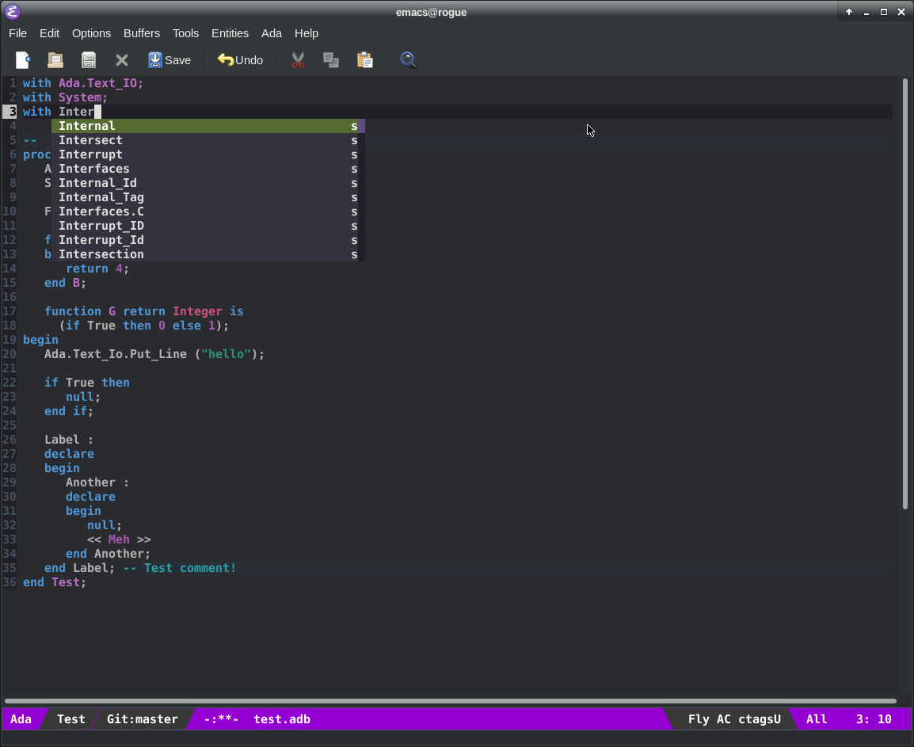

# .emacs

This is my current emacs script, cut n pasted from various places. I've enabled E/Ctags based auto-completion, which
is working, although it's nowhere near as good as real symbol based auto-completion.

## Screenshot

Here's what it looks like on my machine.

